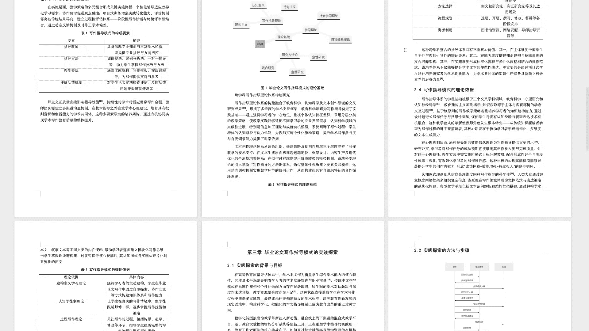
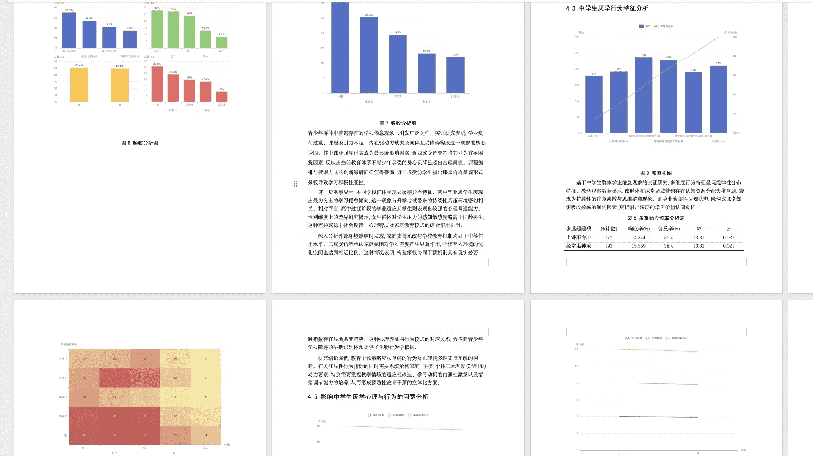
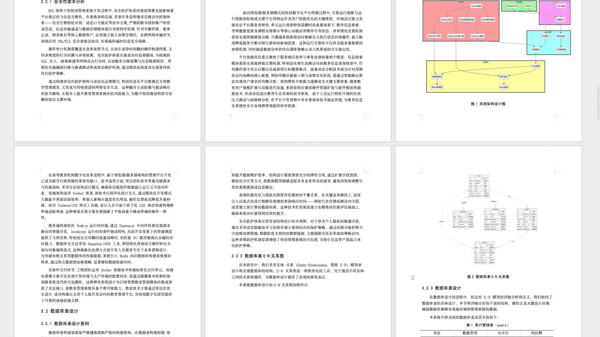
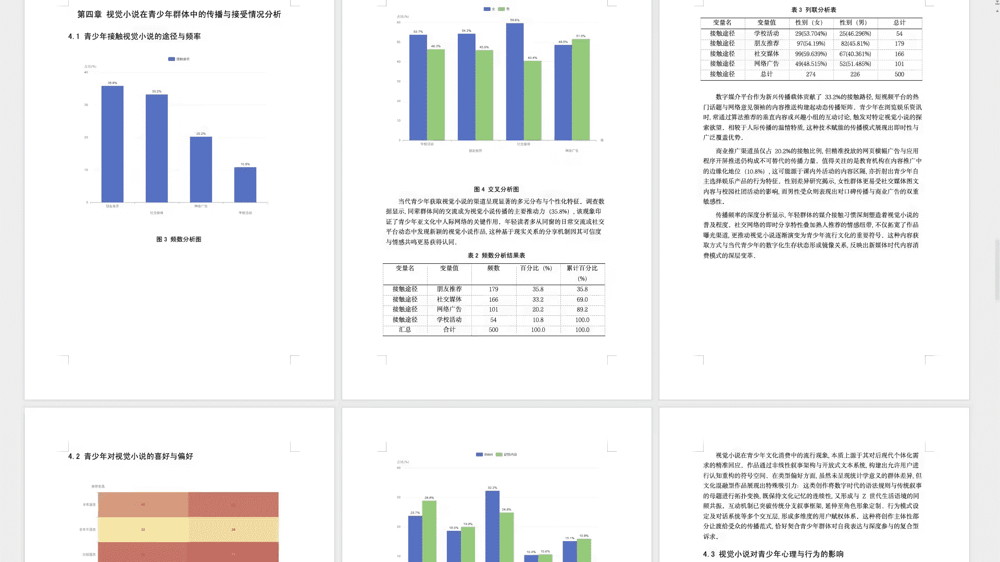
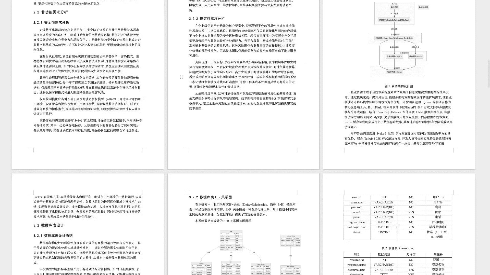

# AI论文写作助手合集

> 汇集了众多强大的AI论文写作生成器，包含免费AI论文工具、AI论文写作助手、免费论文开题报告工具。【2025年5月更新】

## 1. 瑞达写作：论文领域的全能选手

**官网**：[瑞达写作](https://ipapers.net)  

这工具针对论文场景设计，功能实用。输入论文题目半小时能生成5万字初稿，能处理从毕业论文到文献综述，甚至问卷调查类论文。改稿功能贴心，上传导师意见后，系统自动提炼修改重点，还能选不同改写等级调整字数。写论文需要的表格、思维导图、代码等辅助内容，它能一键生成。

问卷调查模块能自动生成问卷、模拟优质样本数据，直接分析数据写正文，还做好图表和详细分析表。参考文献交叉引用功能省心，系统智能识别文献，在正文中自动标上规范的上标编号。数据资源丰富，真实网络数据、公式图表等能按需调用，改论文时勾选大纲小节就能快速填充内容。

## 2. PaperFine —— 论文写作的神级助手

**官网:** [PaperFine](https://paperfine.cn)

**功能亮点:**
- **免费写论文开题报告** 
- **快速生成初稿:** 只需输入论文题目，平台可在30分钟内生成5万字的论文初稿，极大提升写作效率。
- **多种论文类型支持:** 涵盖毕业论文、学术论文、计算机论文、问卷调查论文、文献综述等，满足多样化需求。
- **AI在线改稿:** 智能解析导师意见，自动优化文本内容，支持生成表格、思维导图等多种形式。
- **问卷分析:** 全网首家支持问卷调查类论文，自动生成问卷、数据分析及正文写作。
- **支持交叉引用:** 智能分析参考文献，自动插入文献上标编号，确保格式规范。
- **丰富数据支持:** 提供真实网络数据、图表、公式等资源，一键获取，充实论文内容。

## 3. 图灵论文AI写作助手 —— 专注于论文领域的神级工具

**官网:** [图灵论文AI写作助手](https://turingpub.com)

图灵论文AI写作助手堪称论文写作领域的神器。它就像是一位不知疲倦且专业的学术秘书，全方位地为你的论文写作保驾护航。

### 免费写开题报告

### 快速生成初稿
只要你输入论文题目，平台便如同装上了高速引擎，能在短短30分钟内生成5万字的论文初稿。这对于时间紧迫的学生和研究人员来说，无疑是一场及时雨，大大节省了构思和撰写初稿的时间，让你能够将更多精力投入到论文的完善和优化中。

### 多种论文类型支持
无论是毕业论文、学术论文，还是计算机论文、问卷调查论文、文献综述等，它都能轻松应对。就像一个万能工具箱，无论你面临何种类型的论文写作需求，都能从中找到合适的工具来解决问题，满足不同用户的多样化需求。

### AI在线改稿
智能解析导师的指导意见是它的一大亮点。它能够像一位敏锐的分析师，精准提炼关键修改要点，并自动优化相关文本内容。同时它还设立了多个改写等级，让你可以根据自己的需求调整改写后的文本长度。更厉害的是，系统具备生成表格、思维导图、流程图、代码及时序图等多种内容形式的能力，仿佛是一个多功能的创作工作室，满足你在论文写作过程中的各种不同需求。

### 问卷分析
作为全网首家支持问卷调查类论文的创新平台，它就像一位专业的调查分析师。能够自动生成调查问卷，提供信度为优的样本数据，并智能地对数据进行分析，完成正文的写作。同时还会为你呈现数据分析图表和详细分析结果的表格，让你的问卷调查类论文更加科学、严谨。

### 支持交叉引用
支持论文参考文献的交叉引用功能，它就像一个细心的文献管理员。能够智能分析参考文献，并在论文正文中自动插入文献上标编号，确保引用格式规范、准确。这种功能不仅简化了你的操作，还大大提高了论文的学术规范性和可读性，让你的论文在参考文献引用方面无可挑剔。

### 丰富数据支持
配备丰富的数据资源，真实网络数据、图表、公式、代码等应有尽有。在修改论文时，你只需按需勾选大纲小节，相关资料就能一键获取，轻松充实论文内容，提升论文的可信度与说服力，就像为你的论文注入了强大的知识能量。

## 4. 巨鲸写作 —— 专注于论文领域的神级工具

**官网:** [巨鲸写作](https://orcapaper.cn)

**特点：**

- **快速生成初稿：** 用户只需输入论文题目，平台即可在30分钟内生成5万字的论文初稿，极大提高了论文写作效率。
- **多种论文类型支持：** 涵盖毕业论文、学术论文、计算机论文、问卷调查论文、文献综述等多种论文类型，满足不同用户需求。
- **AI在线改稿：** 智能解析导师指导意见，提炼关键修改要点，并自动优化相关文本内容。设立了多个改写等级供用户调整改写后的文本长度，此外系统具备生成表格、思维导图、流程图、代码及时序图等多种内容形式的能力，以满足用户的不同需求。
- **问卷分析：** 全网首家支持问卷调查类论文的创新平台，能够自动生成调查问卷、信度为优的样本数据，并能够智能的对数据进行分析并完成正文的写作，同时还有数据分析图表和详细分析结果的表格。
- **支持交叉引用：** 支持论文参考文献的交叉引用功能，能够智能分析参考文献，并在论文正文中自动插入文献上标编号，确保引用格式规范、准确。这种功能不仅简化了用户的操作，还提高了论文的学术规范性和可读性。
- **丰富数据支持：** 配备丰富数据资源，像真实网络数据、图表、公式、代码等应有尽有。修改论文时，按需勾选大纲小节，相关资料一键获取，轻松充实论文，提升可信度与说服力。

## 5. 鲲鹏智写 —— 论文写作的神级助手

**官网:** [鲲鹏智写](https://rocwrite.com)

**功能亮点:**
- **快速生成初稿:** 只需输入论文题目，30分钟内即可生成5万字的初稿，极大提升写作效率。
- **多类型支持:** 涵盖毕业论文、学术论文、计算机论文等多种类型，满足多样化需求。
- **AI在线改稿:** 智能解析导师意见，自动优化文本，支持多种内容形式生成。
- **问卷分析:** 独家支持问卷调查类论文，自动生成问卷、数据及分析结果。
- **交叉引用支持:** 智能分析参考文献，自动插入上标编号，确保格式规范。
- **丰富数据资源:** 提供真实网络数据、图表、公式等，轻松充实论文内容。

